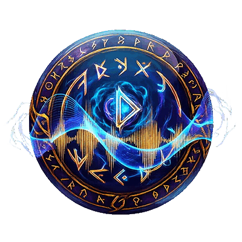

# QuestEcho

Voice add‑on for Emberveil WoW 1.12.1 client. 
Plays audio voice lines when you accept / complete quests and interact with NPC gossip.  

Adds an **Echo** button inside quest log, playback queue status bar, settings panel and replay window.  
  
  

Chat command: `/qe`

> ⚠️ This addon **requires language‑specific audio data pack**. Core addon alone has no sound.

## Downloads
- Main Addon: [QuestEcho‑1.5.1.zip](https://github.com/LeySure/QuestEcho/releases/download/1.5.1/QuestEcho-1.5.1.zip)
- Audio Data Packs (pick one matching your game client language):
  - enUS: [QuestEchoData‑enUS.zip](https://github.com/LeySure/QuestEcho/releases/download/1.5.1/QuestEchoData-enUS.zip)
  - zhCN: (coming soon)
  - ruRU: (coming soon)

## Installation
1. Extract `QuestEcho` into `Interface/AddOns`
2. Extract language data pack, output folder name **must be `QuestEchoData`**, place alongside QuestEcho
3. Restart your WoW client.

## Features
‑ Auto‑play voice for quest accept / complete
‑ NPC gossip voice playback
‑ In‑quest‑log Echo replay button
‑ Play queue status bar, pause / clear / remove single audio item
‑ Configurable settings panel via `/qe settings`
‑ Replay window for reviewing quest voice lines

## Commands
/qe          Show help
/qe settings Open settings panel
/qe questlog Open replay window
/qe status   Show current queue status

## Notes
‑ Each language data pack is separate large‑size archive (~1.2GB).
‑ Do NOT install multiple language packs at same time, they overwrite each other.
‑ If button is greyed‑out: no available voice for this quest.

## 中文说明
QuestEcho 是 Emberveil（1.12.1）语音插件。接取、完成任务以及NPC对话时播放对应语音。
任务日志会显示Echo按钮，附带播放队列状态栏与设置面板。聊天指令 `/qe`。

> ⚠️ 本体插件**不包含语音**，必须安装对应语言数据包才有声音。

### 安装
1. 将 `QuestEcho` 解压到 `Interface/AddOns`
2. 下载对应语言数据包，解压出来文件夹名称必须为 `QuestEchoData`，和主插件放在同一目录
3. 重启游戏。
